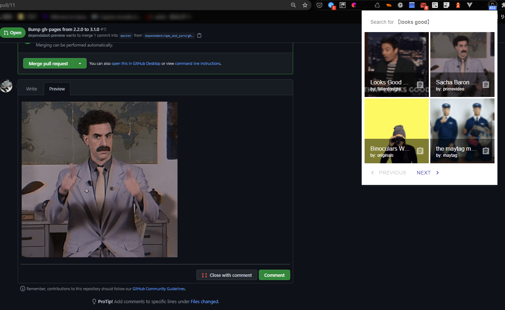
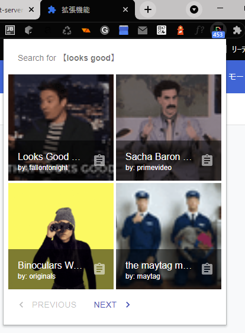
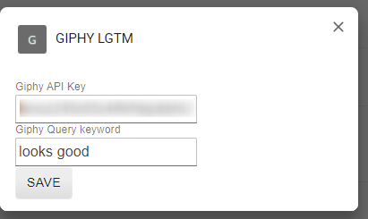
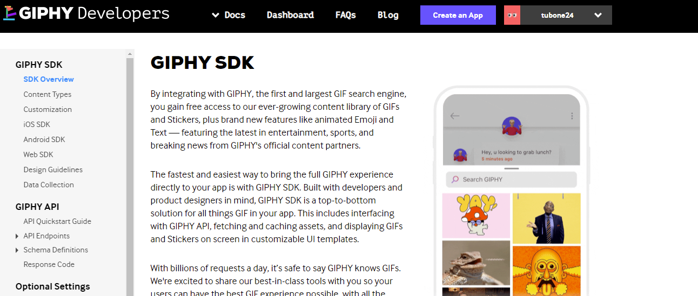
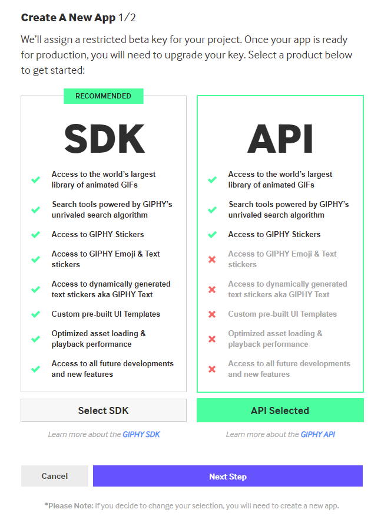
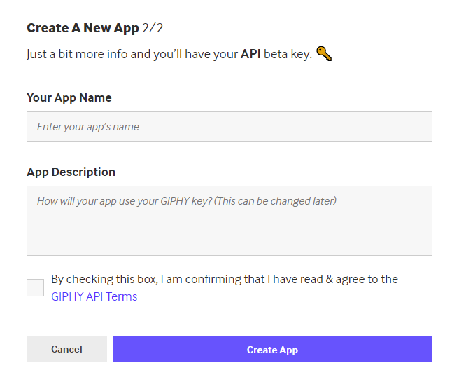
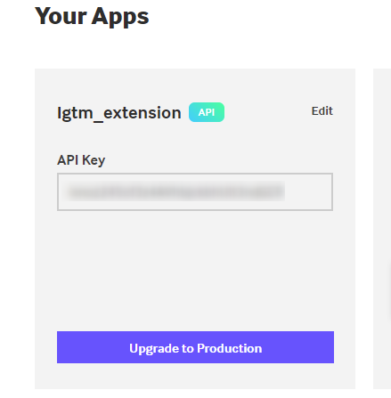
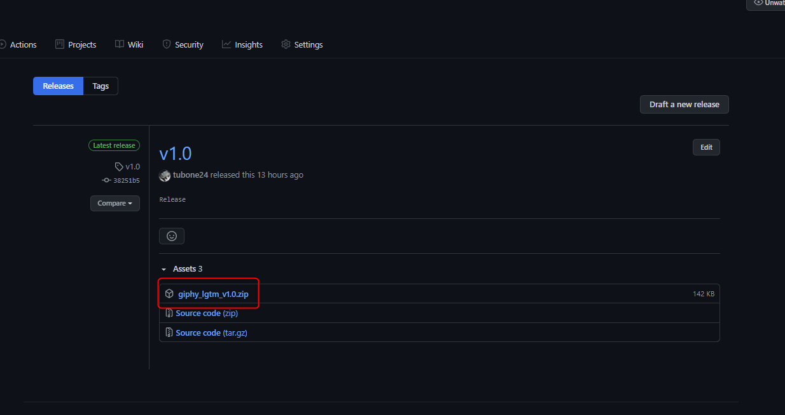
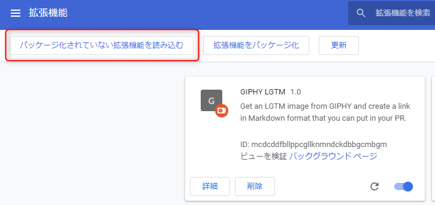
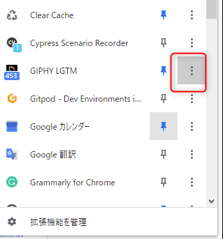

# GIPHY LGTM

> Get an LGTM image from [GIPHY](https://giphy.com/) and create a link in Markdown format that you can put in your Pull Request.



## background
[LGTM](https://www.dictionary.com/e/acronyms/lgtm/) images are often used in GitHub PR, and it's always more fun to have them move as GIF animations if possible.
 
 I often use a service called GIPHY to search for suitable LGTM images, but I wanted to make it easy to create Markdown links for LGTM images in a consistent way, so I decided to create a dedicated Google Chrome extension.

### What does LGTM mean?

> LGTM is an acronym meaning looks good to me, frequently used when reviewing documents.
> 
> (Quotes from [dictionary.com](https://www.dictionary.com/e/acronyms/lgtm/))

## Feature



- Search for GIFs with any keyword from GIPHY and display them on the extension.
- You can generate image links for markdown from the image list view and save them to the clipboard.
- The number of search results is represented by the extension's badge.


- You can specify any search keyword from the options.

## Install

### Precondition

#### First of all, **you need to create an API key** in your [GIPHY](https://giphy.com/) account.

Create an App from create an App by visiting [GIPHY Developers](https://developers.giphy.com/).



The App is created in API mode.



Fill in the required information to complete the App.



Write down the API Key that is set for the App you created. You'll use it later.



### Install the extension on your Chrome

Download the latest version of the ZIP file from the extension's release site.



Extract the zip to any directory on your PC and open Google Chrome.

Open <chrome://extensions/>, select **Load unpackaged extensions**, and specify the directory where you extracted the zip file earlier.



You should now be able to load it successfully.

### Set your API Key

Configure APIKey from the Extension Options screen.



Set the option to the API Key you wrote down earlier.


## For Developer

Build production

```
npm run build
```

Run local

```
npm run watch
```

Format code style with prettier

```
npm run style
```

Test with jest

```
npm run test
```
